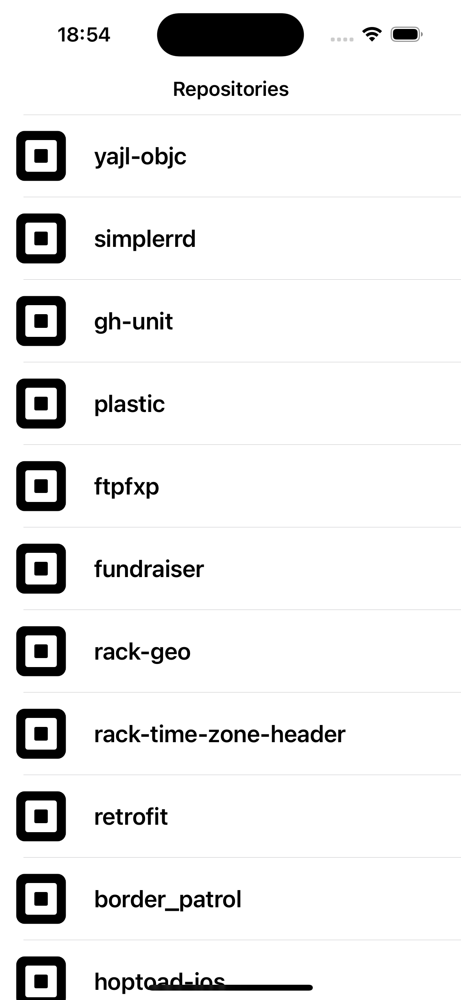
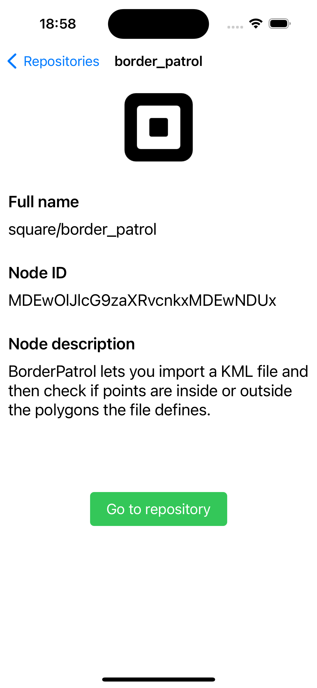

# AzikusTask
Test task at Azikus
# GitHub "square" Repositories Viewer

## Overview

This project is an iOS application that displays a scrollable list of repositories for the "square" organization on GitHub. The app supports pagination to load more data as the user scrolls to the bottom of the list. Each repository entry shows the repository's name, description, and the owner's avatar image. Additionally, the app allows users to view repository details and includes a button to open the repository in a web browser.

## Features

- **Scrollable List of Repositories**: Displays repositories for the "square" organization.
- **Pagination**: Loads new data when the user scrolls to the bottom.
- **Repository Details**: Shows the repository's name, description, and owner's avatar image.
- **Open in Browser**: A button to open the repository in a web browser.
- **Loading and Error States**: Handles loading and error states gracefully.

## Architecture and Design

### Architecture

The application follows the Model-View-Controller (MVC) pattern, which is a commonly used architectural pattern in iOS development. Here's a brief summary of the architecture:

- **Model**: Represents the data structures and business logic. In this project, `RepoInfo` and `Owner` models represent the repository data.
- **View**: Represents the UI components and layouts. The views are primarily constructed using `UIKit` components.
- **Controller**: Acts as a mediator between the Model and the View. It updates the View when the Model changes and vice versa. `ReposViewController` handles the display of repositories, and `RepoDetailsViewController` handles the display of detailed repository information.

### Components

- **Networking**: Handles API requests and data parsing. The `Networking` class is responsible for making network calls and decoding the JSON response.
- **ReposViewController**: Manages the list of repositories and handles pagination.
- **RepoDetailsViewController**: Manages the detailed view of a selected repository.
- **Custom Views and Extensions**: Includes custom UI components and extensions for common tasks (e.g., loading images, rounded avatars).

## Libraries

No external libraries were used in this project. All functionality was implemented using native `Swift` and `UIKit`.

## API

The application fetches repository data from the GitHub API:
```
https://api.github.com/orgs/square/repos
```

## Testing

### Unit Tests

Unit tests were implemented to verify the functionality of the networking layer. The tests ensure that data is loaded correctly and that pagination does indeed work (fetches new data when page index is changed).

## Application preview

### Main screen

Contains list of all repositories displayed using table view. All elements can be selected, after which detail screen displays. Also, pull down to refresh has also been implemented.



### Details screen

Details screen contains the owner avatar, name, full name, node id and a button, which open the internet browser and goes to repository GitHub page.
When back button is pressed, user is returned to main screen.


